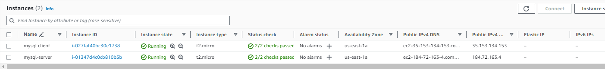
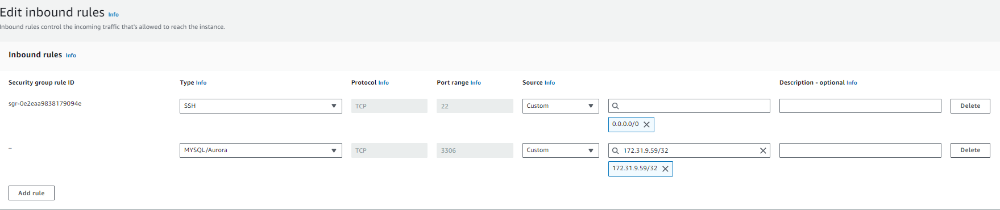
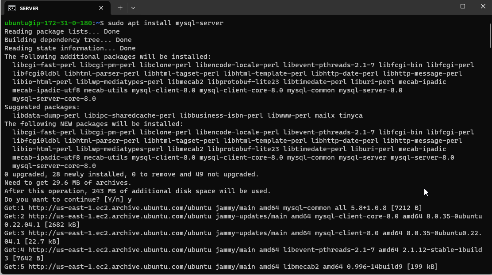
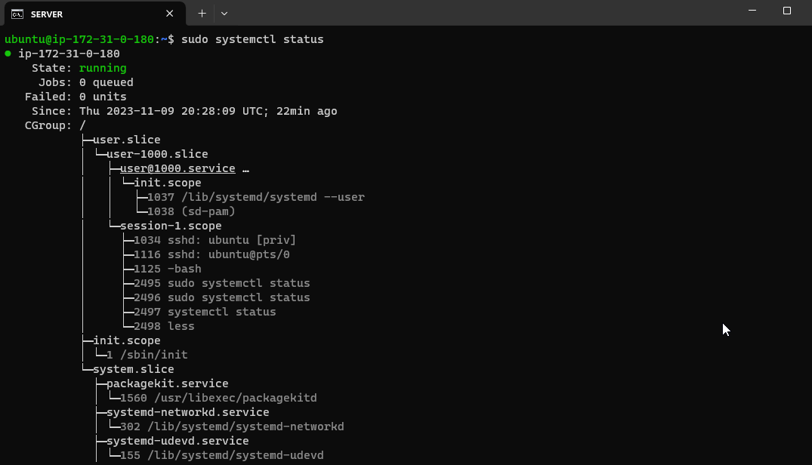
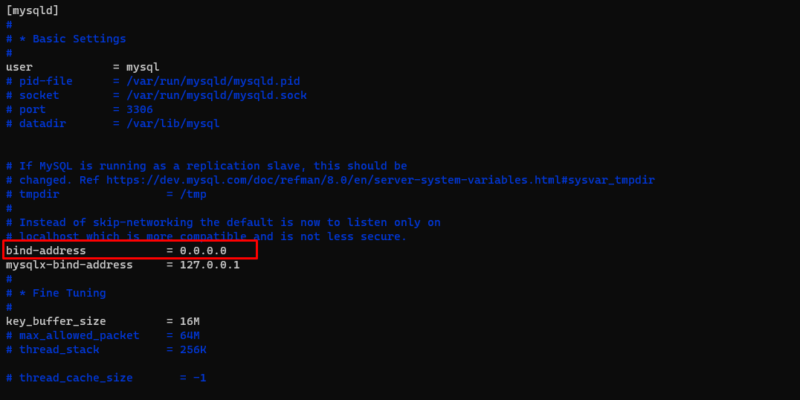
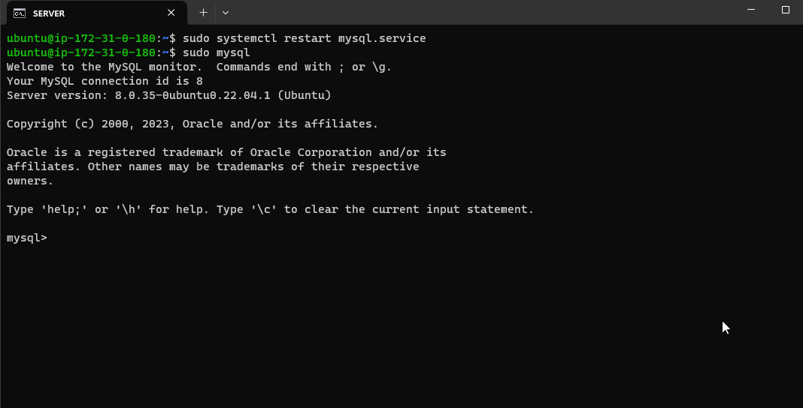
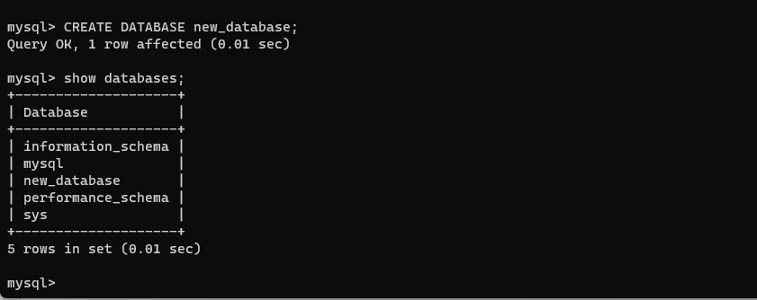
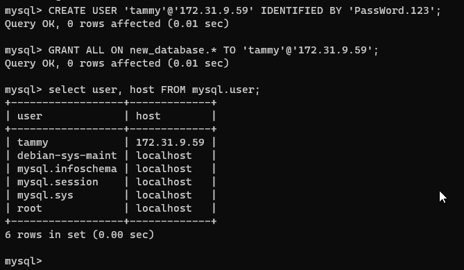
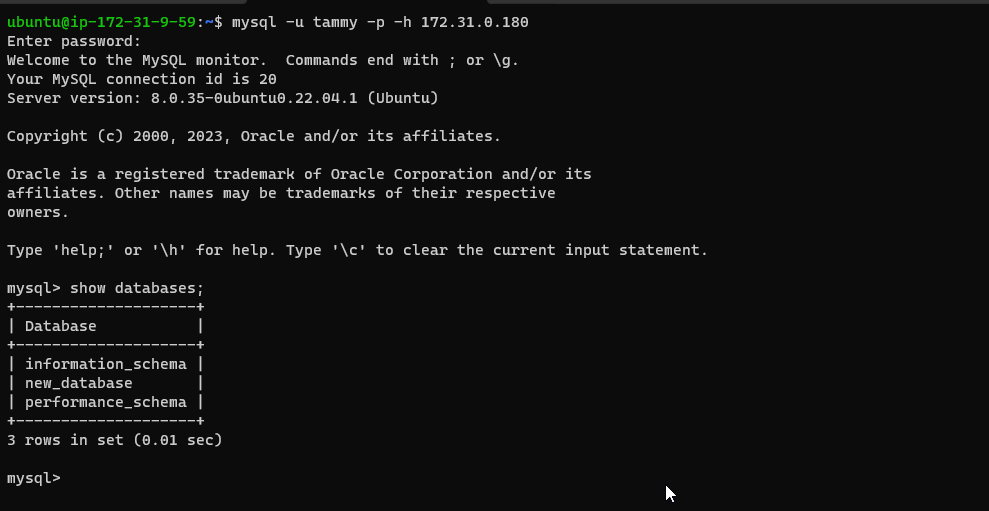

# MySQL-client-server-architecture
Client-Server Architecture with MySQL

In this project we will implement a Client Server Architecture using MySQL Database Management System.

1. Create and configure two Linux-based EC2 instances in AWS.
   - Server A - `mysql server`
   - Server B - `mysql client`

2. On `mysql server` install MySQL Server software.

