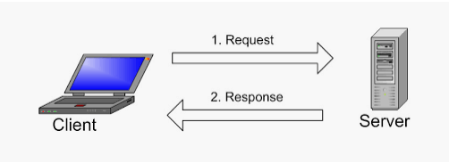

# MySQL-client-server-architecture

In this project we will implement a Client Server Architecture using MySQL Database Management System, but first let's understand Client-Server Architecture better.

## What is Client-Sever Architecture?

Client-Server refers to an architecture in which two or more computers are connected together over a network to send and receive requests between one another.

Each machine has has its own role, the machine sending requests is reffered to as "Client" and the machine respondng is called "Server". In this project we will create two machines, one being Client and the other Server.

### Implement a Client Server Architecture using MySQL

1. Create and configure two Linux-based EC2 instances in AWS.
   - Server A - `mysql server`
   - Server B - `mysql client`

   

2. MySQL server uses port 3306, so open it by creating a new entry in 'inbound rules' in `mysql server` Security Groups. Allow acess to only the local IP address of the `mysql client`

3. On `mysql server` Linux Server install MySQL **Server** software, on `mysql client` Linux Server install MySQL **Client** software

  - Run `sudo apt upgrade` on each machine.
  - Run `sudo apt install mysql-server` for `mysql server`
  - Run `sudo apt install mysql-client` for `mysql client`

4. Check if mysql is running `sudo systemctl status`

5. Configure MySQL binding by editing the configuration file.
   - Run `sudo vim /etc/mysql/mysql.conf.d/mysqld.cnf`

6. Restart the MySQL service to save the modifications.
   - Run `sudo systemctl restart mysql`

#### Allow Remote Access for the MySQL User

7. First we need to create a database and configure access to it.
   - Run `CREATE DATABASE <database_name>;`

8. Next, create a new user `tammy` with hostname as the private IP address and give the user a password `PassWord.123`

   - Run `CREATE USER 'tammy'@'172.31.9.59` IDENTIFIED BY `PassWord.123`

   Give the user permission over `new_database` database that we created.
   - Run `GRANT ALL ON new_database.*TO 'tammy'@'172.31.9.59'`

   - RUN `select user, hist FROM mysql.user;` to check if the user has been craeted.
    

9. On `mysql server` check that you have successfully connected to a remote MySQL server and can perform SQL queries. (**-h**ostname should be the `mysql server` private IP)

   - Run `mysql -u tammy -p -h 172.31.0.180`

# THE END!!

